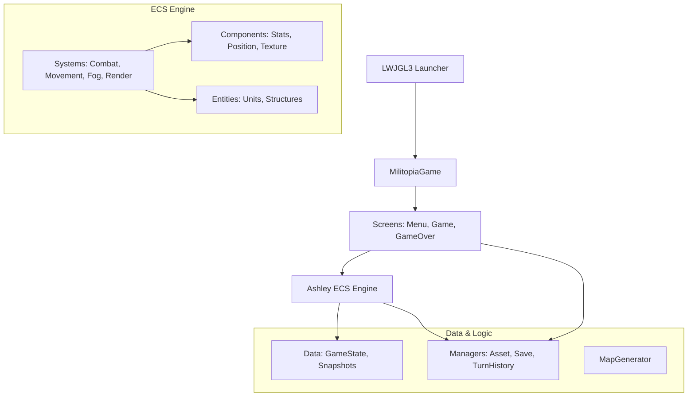

# Architecture

> Generated by /map on 2026-03-16

## Overview
Militopia is a 2-player turn-based strategy game built with **libGDX** and the **Ashley Entity Component System (ECS)**. The game features tactical unit combat on procedurally generated isometric maps.

## System Diagram

## Components

### Core Engine
- **Purpose:** Game entry point and asset orchestration.
- **Location:** `core/src/main/java/com/militopia/MilitopiaGame.java`
- **Dependencies:** libGDX, Ashley

### Systems (ECS)
- **CombatSystem:** Handles attack resolution and ability effects.
- **MovementSystem:** Manages unit navigation and pathing validation.
- **FogSystem:** Calculates visibility and updates Fog of War.
- **MapRenderSystem / UnitRenderSystem:** Isometric rendering with Z-ordering.

### Managers
- **AssetManager:** centralized loading for skins, fonts, and textures.
- **SaveManager:** Handles JSON-based state persistence.
- **TurnHistoryManager:** Tracks snapshots for undo/redo functionality.

## Data Flow
1. **Input:** `GameInputController` captures user actions.
2. **Logic:** ECS Systems process entity updates based on components.
3. **State:** `GameState` and `Snapshots` store the current engine status.
4. **Rendering:** Render Systems draw the updated state to the `GameScreen`.

## Integration Points
| External Service | Type | Purpose |
|------------------|------|---------|
| Filesystem | JSON | Game Save/Load persistence |
| libGDX | Library | Graphics, Input, and Audio framework |

## Conventions
- **Naming:** CamelCase for classes, camelCase for variables/methods. ECS components end with `Component`, systems end with `System`.
- **Structure:** Managed by subprojects (`core`, `lwjgl3`).
- **Testing:** JUnit 5 for core logic validation.

## Technical Debt
- [ ] No major technical debt found in recent scans (0 TODOs).
